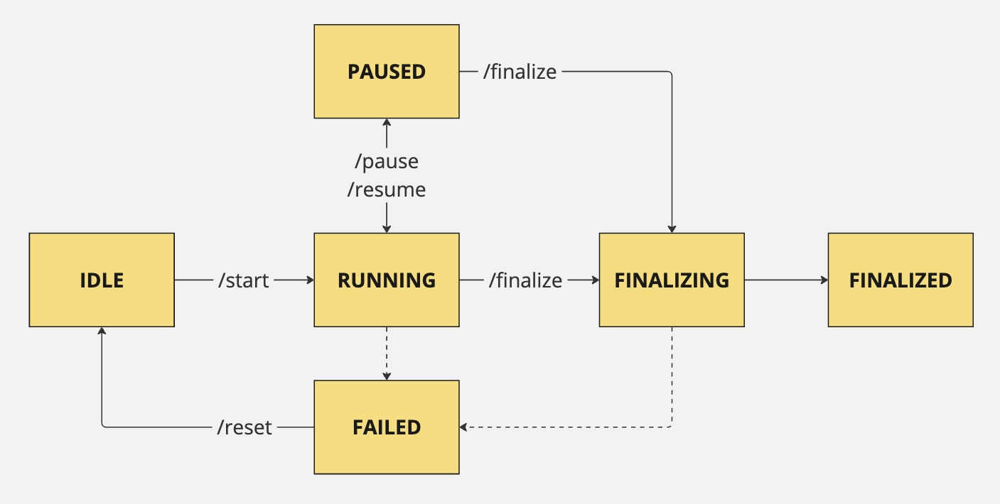

# How {{pml.full_name}} works

{{pml.full_name}} is a binary process that replicates data between MongoDB deployments in real time until you manually finalize it. You can also make a one-time data migration from the source to the target with zero downtime. 

You operate with {{pml.full_name}} using the [set of commands](pml-commands.md) or [API calls](api.md). Depending on the request it receives, {{pml.full_name}} has several states as shown in the following diagram:

* **Idle**: PML is up and running but not migrating data
* **Running** – PML is replicating data from the source to the target. PML enters the running state when you start and resume the replication 
* **Paused** – PML is not running and data is not replicated
* **Finalizing** – PML stops the replication and is doing final checks, creates indexes
* **Finalized** – all checks are complete, data replication is stopped
* **Failed** – PML encountered an error

## Usage scenario

Now, let's use the data migration from MongoDB Atlas to Percona Server for MongoDB as an example to understand how PML works. 

You run a MongoDB Atlas 8.0.8 deployed as a replica set. You need to migrate to Percona Server for MongoDB 8.0.8-3, also a replica set. You have a strict requirement to migrate with zero downtime; therefore, using PBM logical backups is a no-go. 

A solution is to use Percona MongoLink. MongoDB Atlas is your source. A new, empty Percona Server for MongoDB  replica set is your target. Data migration is a resource-intensive task. Therefore, we recommend installing PML closest to the target to reduce the network lag as much as possible. 

Create users for PML in both MongoDB deployments and connect PML to them using these user credentials. Now you are ready to start the migration.

To start the migration, call the start command. PML starts copying the data from the source to the target. After the initial data sync, it monitors changes in the source and replicates them to the target at runtime. You don't have to stop your source deployment, it operates as usual, accepting client requests. PML uses [change streams :octicons-link-external-16:](https://www.mongodb.com/docs/manual/changeStreams/) to track the changes to your data and replicate them to the target.

You can pause the replication and resume it later. When paused, PML saves the timestamp when it stops the replication. After you resume PML, it copies the changes from the saved timestamp and continues real-time replication.

You can track the migration status in logs and using the status command. When the data migration is complete, call the finalize command. This makes PML finalize the replication, create the required indexes on the target, and stop. Note that finalizing is a one-time operation. If you try to start PML again, it will start data copy anew.

Afterwards, you will only need to switch your clients to connect to Percona Server for MongoDB.

## Next steps

Ready to try it out? 

[Quickstart](installation.md){.md-button}
